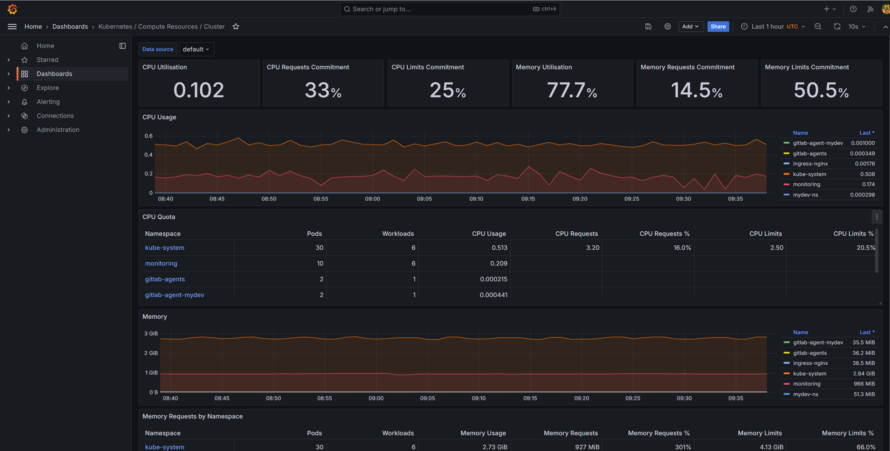
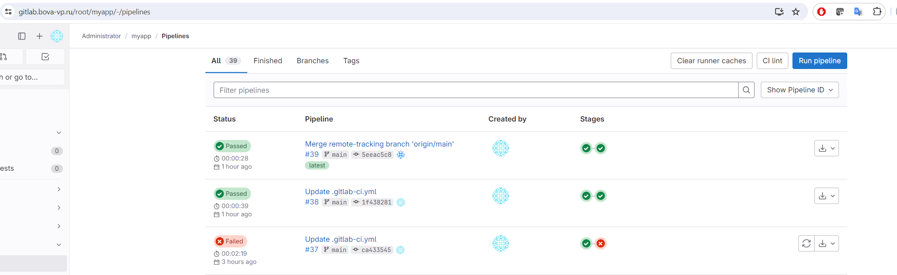
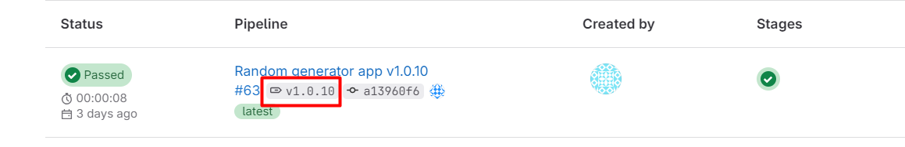

# Дипломная работа


## Yandex Cloud

Создаем каталог k8s


## Создание облачной инфраструктуры


Создание сервисного аккаунта

```
Имя: tfuser
Роли: 
- ydb.admin на таблицу
- editor на бакет
```

Создание бакета для хранения состояния terraform

```
Имя бакета: tfstate-vp
```

Создание базы данных для блокировки состояния terraform

```
Yandex Managed Service for YDB

Название базы данных: tfstate-lock
Название таблицы: tfsate-lock-table (Тип: Документная, Колонки: LockID (String))
```

Перенос state в S3

```SH
terraform init -backend-config="access_key=..u5i3p4iNB.." -backend-config="secret_key=...McOV4R.."
```

Применение конфигурации

```sh
terraform plan
terraform apply
```

### Результат

[Исходный код terraform](./infra/)


## Создание Kubernetes кластера

> Важно: файл инвертори сгенерирован автоматически при помощи terraform в предыдущем шаге (inventory/mycluster/k8s_inventory.ini)

Клонирование kubespray

```SH
cd ~
yum install python3-pip -y
git clone https://github.com/kubernetes-sigs/kubespray.git
cd kubespray

pip3 install -r requirements.txt    

# cp -rfp inventory/sample inventory/mycluster
# declare -a IPS=(192.168.50.10 192.168.50.20 192.168.50.30)

# CONFIG_FILE=inventory/mycluster/hosts.yaml python3 contrib/inventory_builder/inventory.py ${IPS[@]}        
```

Решение проблем с таймаутом  
vi ansible.cfg

```CONF
timeout = 60
```

Команда создания кластера

```SH
ansible-playbook -i /home/vpovetkin/kubespray/inventory/mycluster/k8s_inventory.ini --become --become-user=root cluster.yml
```


## Создание тестового приложения

Установка ingress-nginx

```SH
kubectl apply -f https://raw.githubusercontent.com/kubernetes/ingress-nginx/controller-v1.10.1/deploy/static/provider/baremetal/deploy.yaml
kubectl -n ingress-nginx get svc
```

Создание сервиса

```SH
kubectl apply -f myapp-svc.yml -n mydev-ns
```

Создание Ingress

```SH
kubectl apply -f myapp-ingress-.yaml -n mydev-ns
```

### Результат

> В качестве тестового приложения используется приложение на Pyhton для генерации случайного пароля

https://github.com/bova/myapp.git


> Репозиторий образов находится по следующему адресу

https://hub.docker.com/r/vpovetkin/myapp


## Подготовка cистемы мониторинга и деплой приложения


Экспорт конфигурации для подключения к кластеру

```SH
kubectl config view --minify --raw
```

Установка  HELM

```SH
curl -fsSL -o get_helm.sh https://raw.githubusercontent.com/helm/helm/main/scripts/get-helm-3
chmod 700 get_helm.sh
./get_helm.sh
```

Установка Prometeus

```SH
helm repo add prometheus-community https://prometheus-community.github.io/helm-charts
helm repo update
helm install prometheus prometheus-community/kube-prometheus-stack -n monitoring --create-namespace
```

Создание Ingress для Grafana  
vi ingress-grafana.yaml

```YAML
apiVersion: networking.k8s.io/v1
kind: Ingress
metadata:
  name: http-ingress
spec:
  ingressClassName: nginx
  rules: 
  - host: grafana.bova-vp.ru 
    http:
      paths:
      - path: /
        pathType: Prefix
        backend:
          service:
            name: prometheus-grafana
            port:
              number: 80
```		

> kubectl apply -f ingress-grafana.yaml -n monitoring

### Результат

1. Git репозиторий с конфигурационными файлами для настройки Kubernetes.

Конфигурация представлена в этом выше в предудущем разделе

2. Http доступ к web интерфейсу grafana.

http://grafana.bova-vp.ru/

3. Дашборды в grafana отображающие состояние Kubernetes кластера.



4. Http доступ к тестовому приложению.

http://myapp.bova-vp.ru/


## Установка и настройка CI/CD


Создание агента в Gitlab  
файл: *.gitlab/agents/mydev/config.yaml*

```YAML
# path to config for agent k8s .gitlab/agents/mks-agent
ci_access:
  - id: myapp
```

Установка gitlab agent в кластер

```SH
helm repo add gitlab https://charts.gitlab.io
helm repo update
helm upgrade --install mydev gitlab/gitlab-agent \
    --namespace gitlab-agents \
    --create-namespace \
    --set image.tag=v16.11.5 \
    --set config.token=<secret-token> \
    --set config.kasAddress=ws://158.160.43.106/-/kubernetes-agent/
```


### Результат

1. Интерфейс ci/cd сервиса доступен по http.

https://gitlab.bova-vp.ru./root/myapp

2. При любом коммите в репозиторие с тестовым приложением происходит сборка и отправка в регистр Docker образа.



3. При создании тега (например, v1.0.0) происходит сборка и отправка с соответствующим label в регистри, а также деплой соответствующего Docker образа в кластер Kubernetes.



